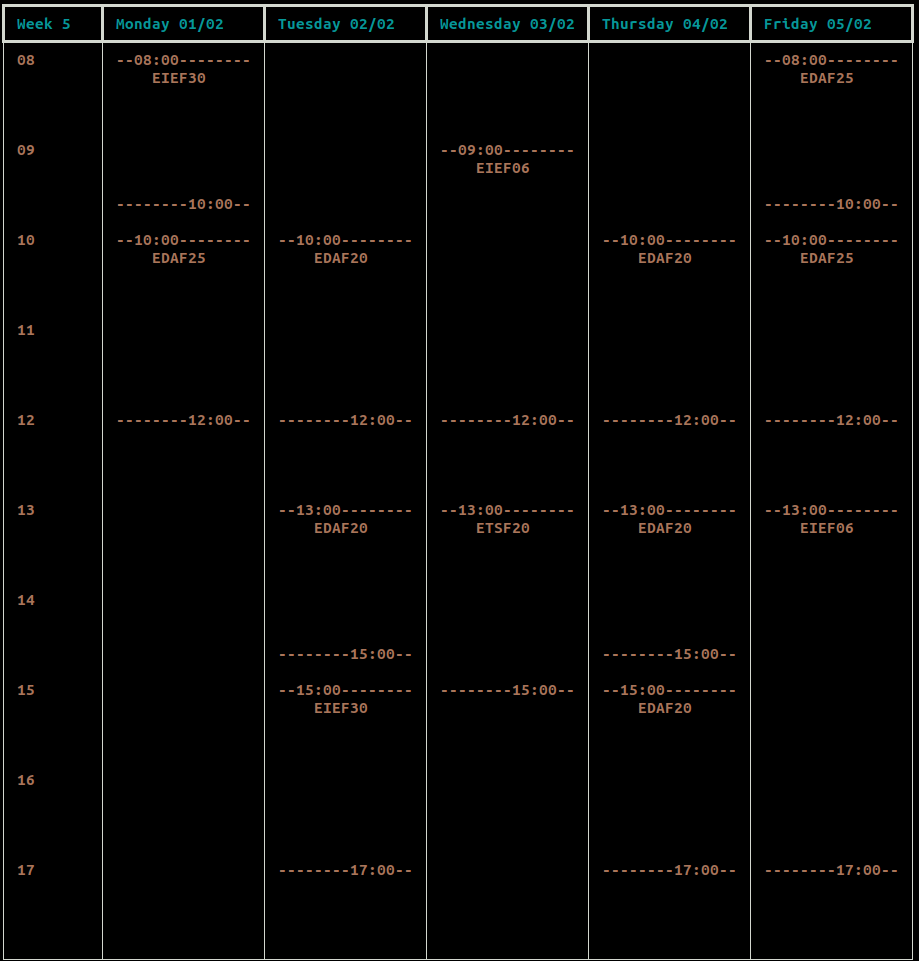

# Timeedit cli schedule

This is a tool to display a schedule from timeedit in a terminal.
It does this by parsing the .ics file and using [python rich library](https://pypi.org/project/rich/) to make the schedule look a big prettier.

Basic usage:
`python cli-timeedit -w WEEK -u URL`

## Output

